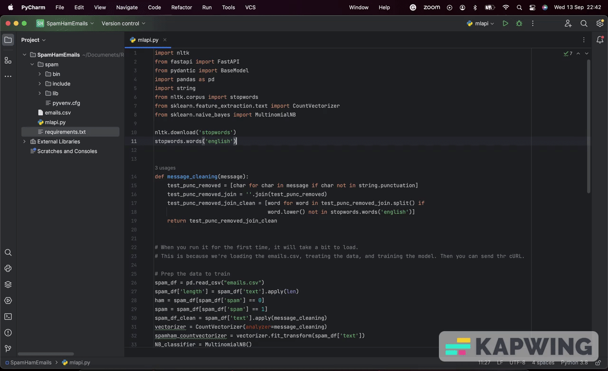

# Email_Spam_Prediction
Project made for the specialization on Machine Learning and Deep Learning. The idea is to learn and understand the naive bayes algorithm and use it for determine if an email is a span or not.

Please Follow the instructions on this repo to install and run the fast api locally (https://github.com/renatomateusx/Car_Purchase_Prediction_Amount/edit/master/README.md)



Below is the cURL for testing the prediction:

```
  curl --location 'http://127.0.0.1:8000/' \
  --header 'Content-Type: application/json' \
  --data '{ 
      "SubjectEmail": "money viagara!!!!!"
  }'
  ```
